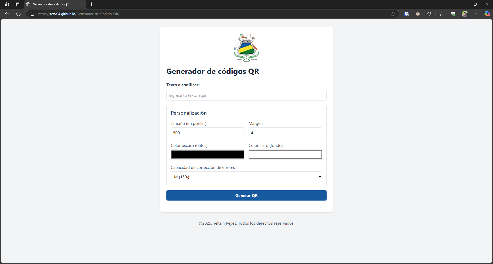

# Generador de Códigos QR

Este proyecto es una aplicación web que permite generar códigos QR personalizados de manera sencilla. Los usuarios pueden ingresar un texto, personalizar el tamaño, los colores, el margen y el nivel de corrección de errores del código QR, y descargarlo como una imagen.

## Características

- **Generación de códigos QR**: Convierte cualquier texto en un código QR.
- **Personalización**:
  - Tamaño del código QR (en píxeles).
  - Margen alrededor del código QR.
  - Colores personalizados para los datos y el fondo.
  - Nivel de corrección de errores (L, M, Q, H).
- **Descarga**: Guarda el código QR generado como una imagen PNG.
- **Interfaz amigable**: Diseño limpio y responsivo utilizando TailwindCSS.

## Tecnologías utilizadas

- **HTML5**: Estructura de la aplicación.
- **JavaScript**: Lógica para la generación y personalización de los códigos QR.
- **[QRCode.js](https://github.com/soldair/node-qrcode)**: Biblioteca para generar códigos QR.
- **TailwindCSS**: Estilización de la interfaz de usuario.

## Instalación y uso

1. **Clonar el repositorio:**
   ```bash
   git clone https://github.com/tu-usuario/Generador-de-Codigo-QR.git
   cd Generador-de-Codigo-QR
   ```
2. **Abril el proyecto:**
- Abre el archivo `index.html` en tu navegador web.

3. **Generar un código QR:**
- Ingresa el texto que deseas codificar.
- Personaliza las opciones según tus necesidades.
- Haz clic en el botón **"Generar QR"**.
- Si deseas descargar el código QR, haz clic en el botón **"Descargar QR"**.

## Estructura del proyecto
```bash
Generador-de-Codigo-QR/
├── [index.html](http://_vscodecontentref_/0)       # Archivo principal de la interfaz
├── [script.js](http://_vscodecontentref_/1)        # Lógica para la generación de códigos QR
├── [uraccan_logo.png](http://_vscodecontentref_/2) # Logo utilizado en la interfaz
```

## Capturas de pantalla
Interfaz principal


Código QR generado


## Créditos
- **Autor:** Yeltsin Reyes
- **Año:** 2025
- **Licencia**: Todos los derechos reservados.